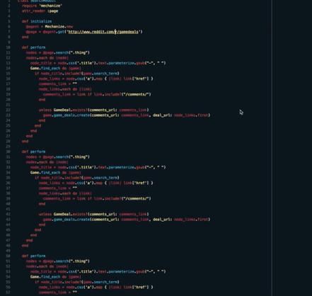

# line-jumper README

Line jumper is a vscode plugin that adds commands to move your cursor and select multiple lines at a time.

## Features

## Usage

Open your keybindings and adjust the commands you desire. Default keybindings are the same as sublime package.

## Commands

* `lineJumper.moveUp`
* `lineJumper.moveDown`
* `lineJumper.selectUp`
* `lineJumper.selectDown`

## Extension Settings

* `lineJumper.linesToJump`: 10

> Tip: Customize number of lines to jump with these commands, default is 10.

**Enjoy!**

## License
MIT